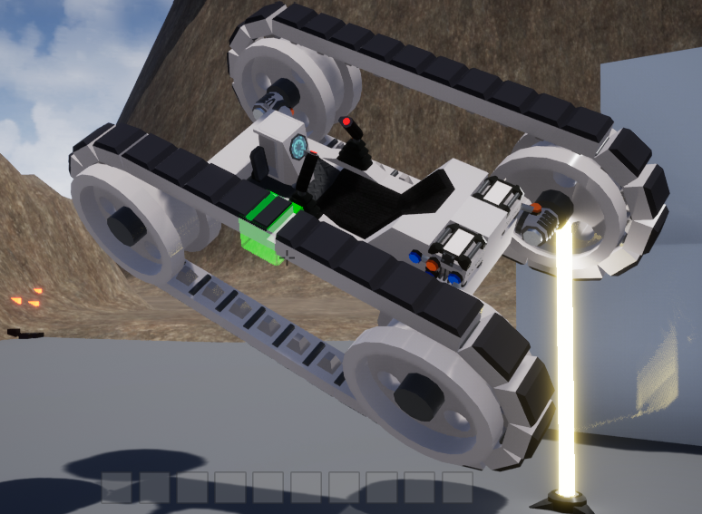
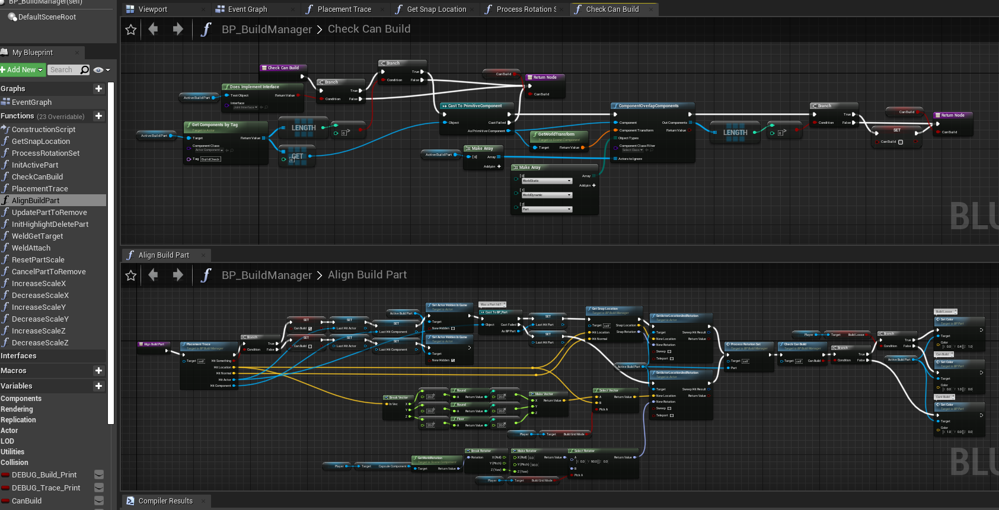
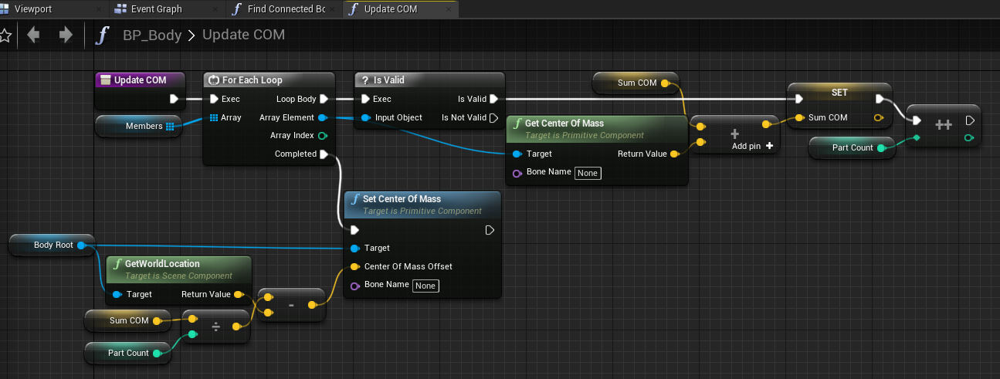

# DropshipVector
My experimental Polygon vehicle builder game in UE4. "Dropship Vector" is just the working title.
I coded the game using Unreal Engine's Blueprints visual scripting language because it was interesting to learn, however for performance I would want to rewrite much of the code as C++.
I began to set up some of the C++ files but have had to put this project on hold for now. 
When I have time for more game development, I may switch to learning Unity for comparison, so depending on how that goes, this project might migrate to Unity/C# instead.

Building a tank-car. 

There's a sort of beauty to visual scripting. These are part of my block alignment system. Instead of a grid of fixed units, my ststem supports snapping alignment to the closest of arbitrary nodes. Nodes on most parts are laid out as if I were using a local grid, but special parts can have unique arrangements of connection points. 

An example of a smaller function where I need to sometimes update the center of mass on a body.
